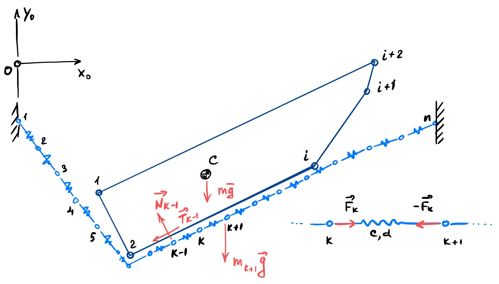

# Плоская модель взаимодействия сети с твердым телом

- Сеть рассматривается как система материальных точек, соединённых невесомыми линено-упругими элементами (пружинами) с заданной жёсткостью (c) и коэффициентом демпфирования (d).

- Твёрдое тело представлено выпуклым многоугольником.

